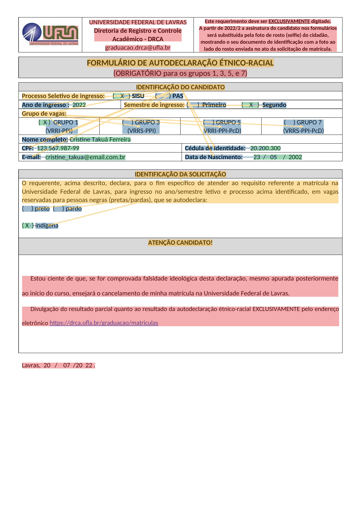
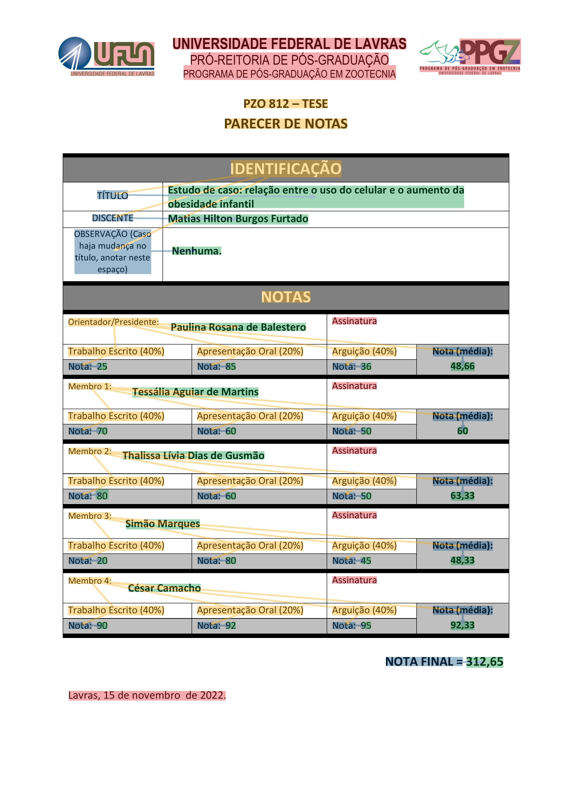
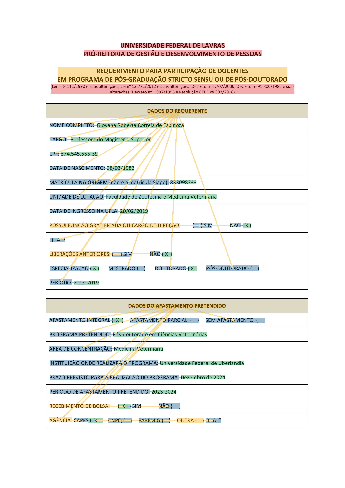
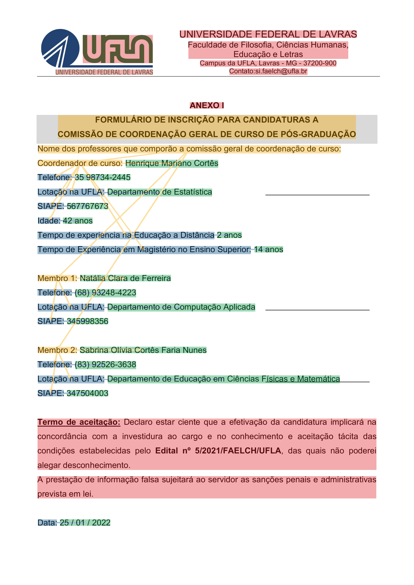

# UFLA-FORMS: Academic Forms Dataset for the Information Extraction Task

## About

**UFLA-FORMS** is a manually labeled dataset of document forms in Brazilian Portuguese extracted from the domains of the <a href="https://ufla.br/">Federal University of Lavras (UFLA)</a>. The dataset emphasizes the hierarchical structure between the entities of a document through their relationships, in addition to the extraction of key-value pairs. Samples were labeled using <a href="https://github.com/Victorgonl/ToolRI/">ToolRI</a>.

## Overview

**UFLA-FORMS** comprises of 200 labeled samples containing 7710 entities with 34396 words and 4442 relationships between them. Each sample is composed of a PNG image extracted from a filled form and a JSON file with it's metadata. The metadata covers labeling information such as sentences, bounding boxes, class labels and relationship pairs. Each entity of the samples were labeled into one of the four classes, according to the <a href="https://guillaumejaume.github.io/FUNSD/">FUNSD</a> dataset: Header, Question, Answer or Other. Images are available in the `image` folder and metadata in the `data` folder. Each sample has the same name (ranging from "000" to "199") for its image and respective metadata in the files names before extensions. A `dataset_info.json` file is available containing information about the dataset, including it's partitions defined for cross-validation and hold-out experiments.

## Examples

The images below presents examples of samples from **UFLA-FORMS**. The highlight colors yellow, blue, green and red represent, respectively, entities of the classes Header, Question, Answer and Other.

  
  
  
  

## Download

**UFLA-FORMS** is made available in this repository and can be downloaded at it's <a href="https://github.com/LabRI-Information-Retrieval-Lab/UFLA-FORMS/releases/tag/v1.0.0/">release</a>.

## Hugging Face Datasets

In `./UFLA-FORMS/` folder of this repository, a script can be found to load and pre-process **UFLA-FORMS** using the <a href="https://huggingface.co/docs/datasets/en/index/">Datasets</a> library of the Hugging Face platform. The code below presents an example of use:

    %pip install datasets pillow transformers

    from datasets import load_dataset

    uflaforms = load_dataset("./UFLA-FORMS/")

## Citation

If you find **UFLA-FORMS** useful in your research, please cite our work:

    @misc{uflaforms,
        title={{UFLA-FORMS: Academic Forms Dataset for the Information Extraction Task}},
        url={https://github.com/LabRI-Information-Retrieval-Lab/UFLA-FORMS/},
        author={Victor Lima and Denilson Pereira},
        year={2024}
    }